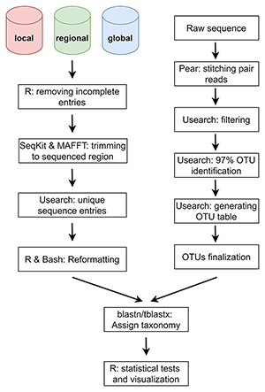

# Sihaloho_etal

```bash
./Sihaloho_etal
├──1_bold
│   ├──rds
│   └──results
├──2_databases
│   ├──data
│   ├──results
│   │   ├──global
│   │   │   ├──blast300
│   │   │   ├──confirm_coordinate
│   │   │   └──usearch
│   │   ├──local
│   │   │   ├──blast300
│   │   │   └──usearch
│   │   └──regional
│   │       ├──blast300
│   │       └──usearch
│   ├──results_blastn300
│   ├──results_figures
│   └──results_tblastx300
├──3_cutadapt
│   ├──filtered
│   ├──lt_db
│   ├──output
│   │   └──otus_finalize
│   └──stitched
├──4_saturation
│   └──data
│       ├──dambe
│       └──global
│           └──dambe
└──COI_252_samples
```


