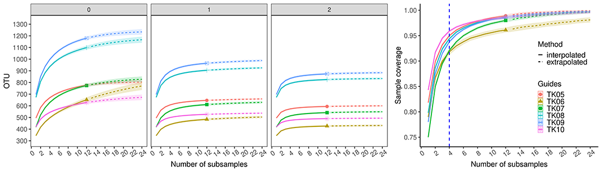

# Optimizing Methods for Insect Metabarcoding



## Introduction
This project goal was identifying the number of subsamples required to detect total estimated insect OTU diversity in a light trap.

## Methods
* [Step 1] - Prepare databases.
  
  * [Download](https://github.com/mhenso/insect_metabarcoding/tree/main/all_insecta.nb.html) from BOLD repository
  
  * [Cleaning](https://github.com/mhenso/insect_metabarcoding/tree/main/db5.nb.html) database entries
    

* [Step 2](https://mhenso.github.io/public/docs/db5.nb.html) - Reshape and compare the databases.
  
  * [Shell_scripting](https://github.com/mhenso/insect_metabarcoding/blob/main/2_databases/2_databases_revised.sh) Using seqkit, mafft, usearch, blast+ and R
    
  * [Remove NUMTS](https://github.com/mhenso/insect_metabarcoding/blob/main/2_databases/2_databases_revised.sh)
 
  * [Blast reseults](https://github.com/mhenso/insect_metabarcoding/blob/main/2_databases/2_databases_revised.sh)
 
  * [Saturation](https://github.com/mhenso/insect_metabarcoding/blob/main/2_databases/2_databases_revised.sh)
  

* [Step 3](https://mhenso.github.io/public/docs/db5.nb.html) - OTUs pipeline.

  * [Shell_scripting](https://github.com/mhenso/insect_metabarcoding/blob/main/2_databases/2_databases_revised.sh) Using usearch and R
 
  * [Remove NUMTS](https://github.com/mhenso/insect_metabarcoding/blob/main/2_databases/2_databases_revised.sh)


* [Step 5](https://mhenso.github.io/public/docs/db5.nb.html) - OTUs pipeline for external dataset.

  * [Shell_scripting](https://github.com/mhenso/insect_metabarcoding/blob/main/2_databases/2_databases_revised.sh) Using usearch and R
 
  * [Remove NUMTS](https://github.com/mhenso/insect_metabarcoding/blob/main/2_databases/2_databases_revised.sh)


## Reference
Sihaloho HF, Azhar I, Gani M, Senawi J, Yong LS, Ayub Q, De R, Kingston T, Phillips CD. in press. Optimizing Methods for Insect Metabarcoding. 

## SRA
The raw reads generated in this study are available at GenBank Sequence Read Archive, BioProject accession number [PRJNA1260500](http://www.ncbi.nlm.nih.gov/bioproject/1260500)

```bash
./Sihaloho_etal
├──1_bold
│   ├──rds
│   └──results
├──2_databases
│   ├──data
│   ├──results
│   │   ├──global
│   │   │   ├──blast300
│   │   │   ├──confirm_coordinate
│   │   │   └──usearch
│   │   ├──local
│   │   │   ├──blast300
│   │   │   └──usearch
│   │   └──regional
│   │       ├──blast300
│   │       └──usearch
│   ├──results_blastn300
│   ├──results_figures
│   └──results_tblastx300
├──3_cutadapt
│   ├──filtered
│   ├──lt_db
│   ├──output
│   │   └──otus_finalize
│   └──stitched
├──4_saturation
│   └──data
│       ├──dambe
│       └──global
│           └──dambe
└──COI_252_samples
```


